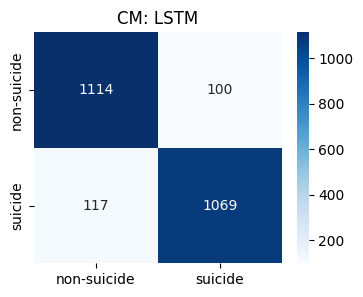
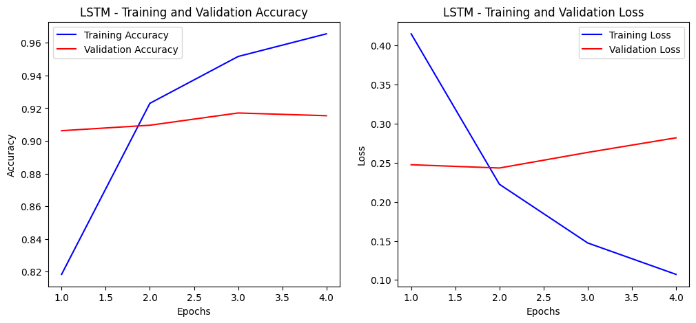
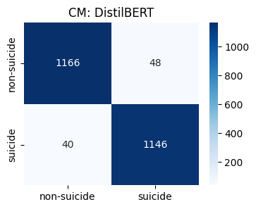
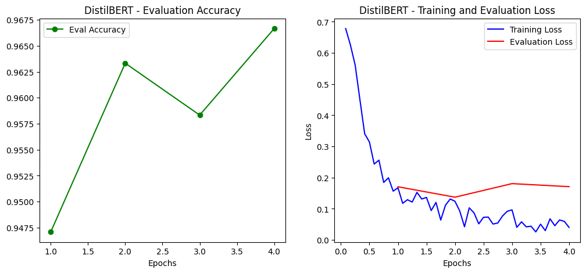
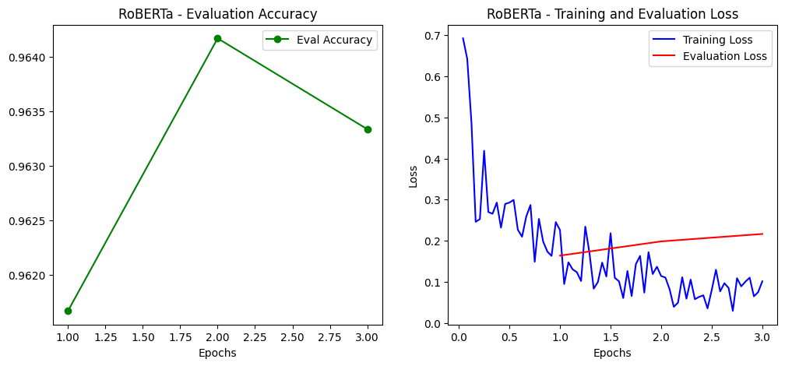
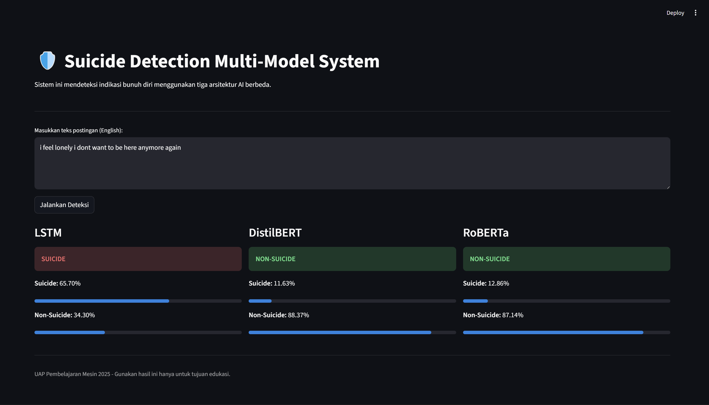

# <h1 align="center">🛡️ SUICIDE DETECTION MULTI-MODEL SYSTEM 🛡️</h1>

<div align="center">
  
  <p>
    <small>
      Implementasi Deep Learning dan Transformer untuk Deteksi Dini Risiko Kesehatan Mental melalui Teks.
    </small>
  </p>
</div>

# <h1 align="center">TABLE OF CONTENT</h1>

1. [Deskripsi Project](#-deskripsi-project-)
      - [Latar Belakang](#latar-belakang)
      - [Tujuan Pengembangan](#tujuan-pengembangan)
2. [Sumber Dataset](#-sumber-dataset-)
3. [Preprocessing dan Pemodelan](#-preprocessing-dan-pemodelan-)
      - [Preprocessing Data](#preprocessing-data)
      - [Pemodelan](#pemodelan)
4. [Langkah Instalasi](#-langkah-instalasi-)
      - [Software Utama](#software-utama)
      - [Dependensi](#dependensi)
      - [Menjalankan Sistem Prediksi](#menjalankan-sistem-prediksi)
5. [Hasil dan Analisis](#-hasil-dan-analisis-)
      - [Tabel Perbandingan Model](#tabel-perbandingan-model)
      - [Visualisasi Evaluasi](#visualisasi-evaluasi)
6. [Sistem Sederhana Streamlit](#-sistem-sederhana-streamlit-)
      - [Tampilan Aplikasi](#tampilan-aplikasi)
7. [Biodata](#-biodata-)  

---

<h1 align="center">🔍 Deskripsi Project 🔍</h1>

Proyek ini bertujuan untuk membangun sistem otomasi klasifikasi teks yang mampu mendeteksi indikasi intensi bunuh diri dalam postingan media sosial. Dengan memanfaatkan teknologi **Natural Language Processing (NLP)**, sistem ini membandingkan tiga arsitektur berbeda untuk mendapatkan akurasi deteksi terbaik.

### **Latar Belakang**

Media sosial seringkali menjadi tempat bagi individu untuk mengekspresikan kondisi mental mereka. Deteksi dini terhadap kata-kata yang mengandung risiko melukai diri sendiri dapat membantu pihak terkait memberikan bantuan lebih awal. 

Kategori klasifikasi dalam project ini adalah:
- **Suicide**: Menunjukkan adanya risiko atau pemikiran bunuh diri.
- **Non-Suicide**: Teks percakapan normal atau tidak berisiko.

---

### **Tujuan Pengembangan**

1. **Membandingkan Performa Model**: Menganalisis efektivitas model rekurens (LSTM) dibandingkan model Transformer (BERT/RoBERTa).
2. **Fine-Tuning Transformer**: Melakukan optimasi pada model pre-trained untuk tugas klasifikasi teks spesifik.
3. **Deployment**: Menyediakan interface sederhana berbasis web untuk pengujian model secara real-time.

---

<h1 align="center">📊 Sumber Dataset 📊</h1>

Dataset yang digunakan dalam proyek ini diambil dari platform **Kaggle**:
- **Judul**: *Suicide and Depression Detection Dataset*.
- **Konten**: Kumpulan data teks dari Reddit yang telah melalui proses pelabelan manual menjadi kategori "suicide" dan "non-suicide".

---

<h1 align="center">🧑‍💻 Preprocessing dan Pemodelan 🧑‍💻</h1>

### Preprocessing Data

1. **LSTM Preprocessing**:
   - Menghapus tanda baca, angka, dan karakter khusus.
   - Case folding (mengubah ke huruf kecil).
   - Tokenisasi dan padding sekuens teks.
2. **Transformer Preprocessing**:
   - Menggunakan tokenizer spesifik (DistilBERT/RoBERTa Tokenizer).
   - Mempertahankan struktur kalimat asli guna menjaga konteks emosional teks.

### Pemodelan

1. **LSTM (Long Short-Term Memory)**: Model Deep Learning yang efektif dalam menangani data sekuensial teks.
2. **DistilBERT (Fine-Tuning)**: Model Transformer yang lebih ringan dan cepat namun tetap memiliki performa tinggi.
3. **RoBERTa (Fine-Tuning)**: Model Transformer yang dikembangkan dengan optimasi pelatihan yang lebih mendalam dibanding BERT original.

---

<h1 align="center">🔧 Langkah Instalasi 🔧</h1>

### Software Utama
- Python 3.10.x
- VS Code / Google Colab

### Dependensi
Instal semua library yang dibutuhkan lewat terminal atau command prompt:
```bash
pip install -r requirements.txt
```

### Menjalankan Sistem Prediksi
1. Aktifkan virtual environment (opsional tetapi direkomendasikan).
2. Jalankan perintah berikut untuk membuka antarmuka Streamlit secara lokal:
       ```bash
       streamlit run app.py
       ```
3. Buka tautan yang muncul di terminal (biasanya http://localhost:8501) melalui browser favorit Anda.

---

<h1 align="center">🔍 Hasil dan Analisis 🔍</h1>

### Tabel Perbandingan Model
| Nama Model              | Akurasi | Catatan Singkat |
|-------------------------|:-------:|-----------------|
| LSTM                    | 91%     | Unggul pada kata kunci tertentu namun mulai menurun ketika konteks kalimat sangat panjang. |
| DistilBERT (Fine-Tune)  | 96%     | Performa tinggi dengan inferensi cepat; efektif menangkap nuansa emosi teks. |
| RoBERTa (Fine-Tune)     | 96%     | Hasil paling stabil karena pemahaman konteks bahasa yang lebih kaya. |

### Visualisasi Evaluasi
- **LSTM**: kombinasi confusion matrix dan learning curve untuk memantau stabilitas pelatihan.
      - 
      - 
- **DistilBERT**: menampilkan distribusi prediksi dan dinamika training loss.
      - 
      - 
- **RoBERTa**: memvisualisasikan ketahanan model terhadap variasi teks tidak teratur.
      - 
      - 

---

<h1 align="center">🎓 Sistem Sederhana Streamlit 🎓</h1>

### Tampilan Aplikasi
Sistem menyediakan dashboard interaktif untuk memasukkan teks, memilih model, dan langsung melihat prediksi risiko bunuh diri secara berdampingan.

<div align="center">
      
</div>

---

<h1 align="center">👤 Biodata 👤</h1>

- Muhammad Eka Nur Arief  
- NIM: 202210370311299  
- Program Studi Teknik Informatika  
- Universitas Muhammadiyah Malang
